# Project Proposal: MySaveFood
INFO 4335 Section 01: MOBILE APPLICATION DEVELOPMENT Group Project

## a) Group Members
| Name | Matric Number | Responsibilities |
| :--- | :--- | :--- |
| **ABDULLAH HARIS BIN ABDUL RASHID** | 2212901 | Proposal Draft, UI/UX Design, Frontend Logic |
| **MUHAMMAD MUIZZUDDIN BIN AMIN** | 2220323 | Mockup, Firebase Integration, Authentication |
| **MOHAMAD NUR HAKIMI BIN ASMADI** | 2213091 | Sequence Diagram, State Management, Architecture |

## b) Project Title
**MySaveFood: Platform to Donate and Receive Leftovers For Free**

## c) Introduction
### Problem Statement
Food waste is a critical issue in university campus environments. Cafeterias often dispose of edible food at the end of the day because they cannot sell it, while many students struggle with budgeting for meals. There is a disconnect between surplus food providers and those in need.

### Motivation
Our motivation is to bridge this gap using mobile technology. By creating a real-time platform, we can reduce food wastage and simultaneously support student welfare.

### Relevance
This project aligns with the **Social Welfare & NGO** and **Productivity/Utilities** domains. We ground our project in global sustainability goals and the **Tawhidic Epistemology** framework:

**1. UN Sustainable Development Goals (SDGs)**
* **Goal 2 (Zero Hunger):** Directly addresses student hunger by redistributing surplus food to those in need.
* **Goal 12 (Responsible Consumption):** Tackles food waste at the source, ensuring sustainable consumption patterns.

**2. Alignment with IIUM’s Tawhidic Epistemology**
* **Purpose-Driven Knowledge:** We recognize that technical knowledge is not value-neutral; it must serve higher purposes. MySaveFood utilizes mobile development skills to specifically target **societal welfare**, ensuring that our technical capabilities are directed toward aiding the community and promoting social justice.
* **Ethical Responsibility:** We believe knowledge acquisition comes with an ethical duty to use it for good. This app allows us to fulfill our role as God's **vicegerents (stewards)** on Earth by actively reducing waste and managing resources responsibly to benefit others.

## d) Objectives
1. To develop a platform that allows cafeteria owners to broadcast availability of surplus or near-expiry food instantly.
2. To provide students with a real-time discovery tool to locate and claim free food on campus.
3. To implement a fair reservation system that prevents overcrowding and ensures food goes to those who claim it first.
4. To strictly observe Shariah-compliant values by ensuring all listed food is Halal and the platform promotes ethical sharing.

## e) Target Users
### 1. Donors (Cafe Owners/Staff)
* **Demographics:** Campus cafeteria operators and food stall owners.
* **Behavior:** Busy individuals who need a quick (under 30 seconds) way to list items before closing time.
* **Goal:** Clear inventory without throwing food away and contribute to CSR (Corporate Social Responsibility).

### 2. Receivers (Students)
* **Demographics:** University students, particularly those living on or near campus.
* **Behavior:** Tech-savvy, budget-conscious, often looking for meals during late hours or end-of-day.
* **Goal:** Access affordable (free) meals and reduce daily expenses.

## f) Features and Functionalities
### Core Modules
1.  **User Authentication:** Secure login/registration using Email or Google Sign-In (distinguishing between Donor and Student roles).
2.  **Food Feed (Home Screen):** A list of currently available food items displayed with photos, quantity, pickup location, and "Best Before" time.
3.  **Post Item (Donor):** A simple form for donors to snap a photo, add a description, and set the quantity of leftover food.
4.  **Claim System (Student):** A "Reserve" button that decrements the available quantity in real-time to prevent double-booking.
5.  **Notifications:** Push notifications to alert students when new food is posted near them.
6.  **Profile & History:** Users can view their past donations or claimed items.
7.  **Reporting & Moderation:** A dedicated feature allowing users to report suspicious activity, fake listings, or non-Halal food items. This ensures the platform remains safe and trusted.

### Shariah Compliance
* **Halal Verification:** All registered Donors must be Halal-certified vendors.
* **Ethical Usage:** The reporting system actively prevents abuse, ensuring the platform is used solely for genuine charitable purposes.

## g) Proposed UI Mock-up
  <figcaption><strong>Figure 1:</strong> Login Page Mockup</figcaption>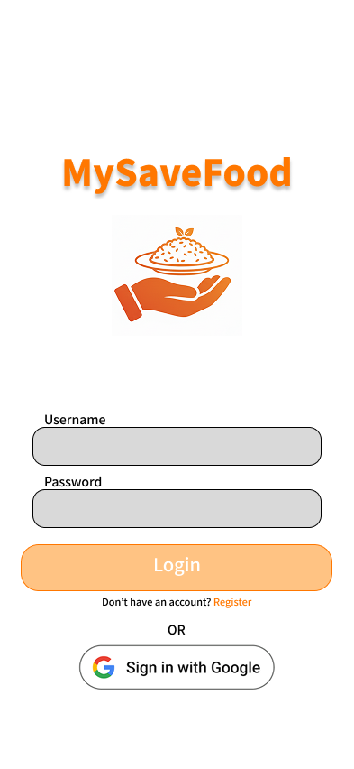
  <figcaption><strong>Figure 2:</strong> Food List Mockup</figcaption>
  <figcaption><strong>Figure 3:</strong> Donate Food Mockup</figcaption>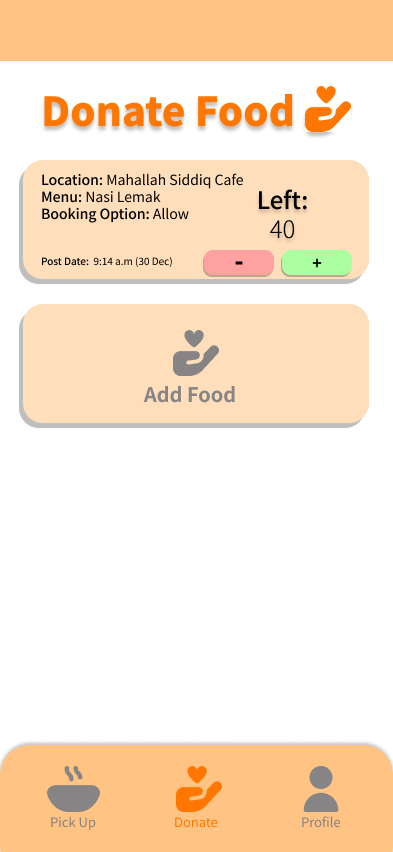
  <figcaption><strong>Figure 4:</strong> Profile Page Mockup</figcaption>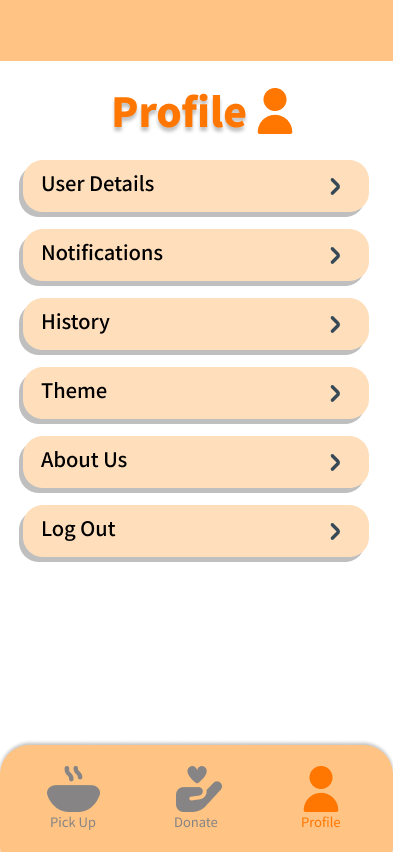

> *The sketches above demonstrate the user-friendly layout and consistent color scheme planned for the final app.*

## h) Architecture / Technical Design
### Framework
We will use **Flutter** to ensure cross-platform compatibility (Android & iOS) and high performance.

### Widget Structure
* **StatelessWidgets:** For static UI elements (e.g., Headers, Info Cards).
* **StatefulWidgets:** For interactive forms (e.g., Post Food Form, Login Page).

### State Management
We will utilize **Provider** (or Riverpod) for state management. This will allow us to efficiently manage user authentication states and the real-time list of food items across the application without "prop drilling."

### Design Pattern
We will follow the **MVVM (Model-View-ViewModel)** architecture to separate the business logic (ViewModel) from the UI (View), ensuring the code is modular and testable.

## i) Data Model
We will use **Cloud Firestore** (NoSQL) for the database.

### Collections Structure

**1. `users` Collection**
* `uid` (String, PK)
* `name` (String)
* `role` (String: 'donor' or 'student')
* `email` (String)

**2. `food_items` Collection**
* `itemId` (String, PK)
* `donorId` (Reference to users)
* `imageUrl` (String - stored in Firebase Storage)
* `title` (String)
* `description` (String)
* `quantity` (Integer)
* `pickupLocation` (String)
* `expiryTime` (Timestamp)
* `status` (String: 'available', 'claimed')

**3. `claims` Collection**
* `claimId` (String, PK)
* `itemId` (Reference to food_items)
* `studentId` (Reference to users)
* `timestamp` (Timestamp)

## j) Sequence Diagram

<figcaption><strong>Figure 5:</strong> General Sequence Diagram</figcaption>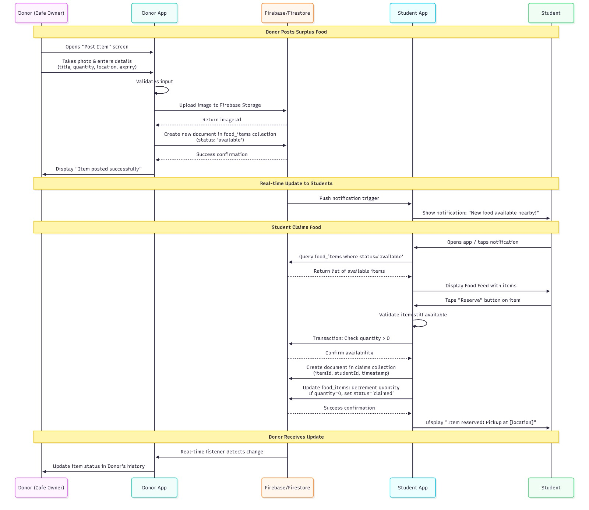

> *The diagram above illustrates the sequence of a Donor posting an item, the item appearing on the Student's feed, and the Student successfully claiming the item, which updates the database in real-time.*

## k) References
1.  **Flutter Documentation:** https://flutter.dev/docs
2.  **Firebase Documentation:** https://firebase.google.com/docs
3.  **Provider Package:** https://pub.dev/packages/provider
4.  **Material Design Guidelines:** https://material.io/design
5.  **Olio - Food Sharing Revolution. (n.d.). Retrieved from https://olioapp.com/en/**
>>>>>>> 2db4742ed5e990403b86fa91f370274fe623b74f

---

# Final Project Report: MySaveFood

## 1. Final UI Screenshots
### A. Login/Registration Page
<figcaption><strong>Figure 6:</strong> Registration Page</figcaption>
<figcaption><strong>Figure 7:</strong> Login Page</figcaption>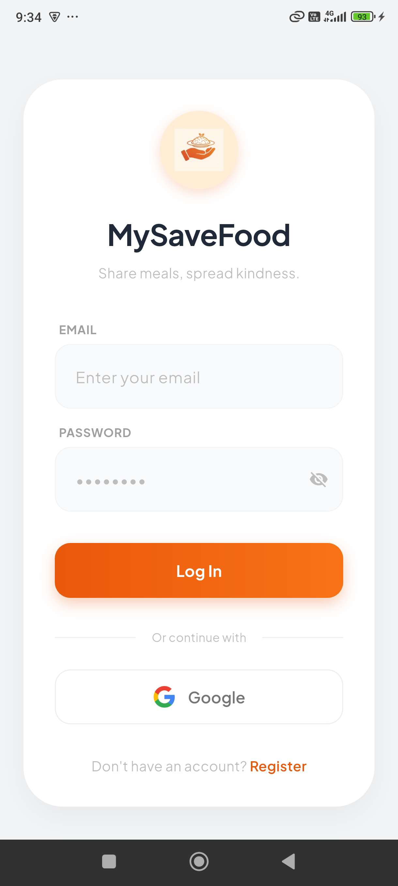

### B. Student (Receiver) Ecosystem
<figcaption><strong>Figure 8:</strong> Receiver Account Page</figcaption>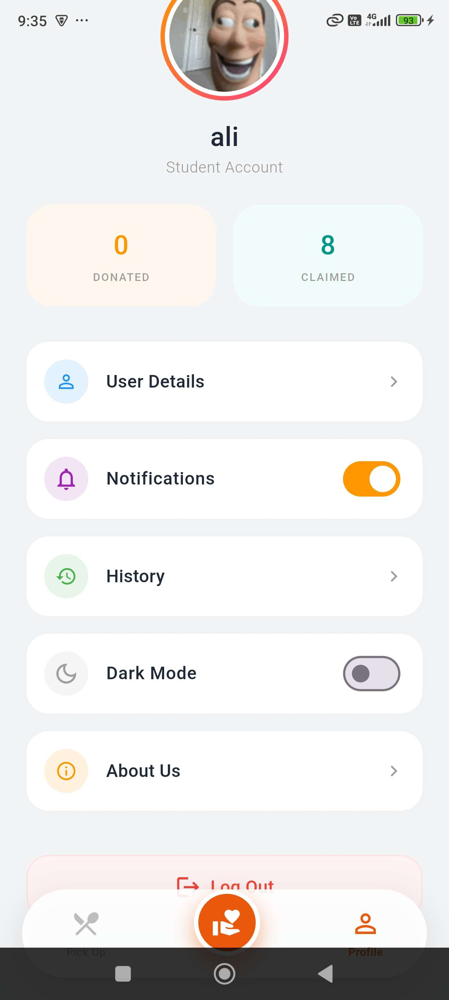
<figcaption><strong>Figure 9:</strong> Receiver Pickup Food Page</figcaption>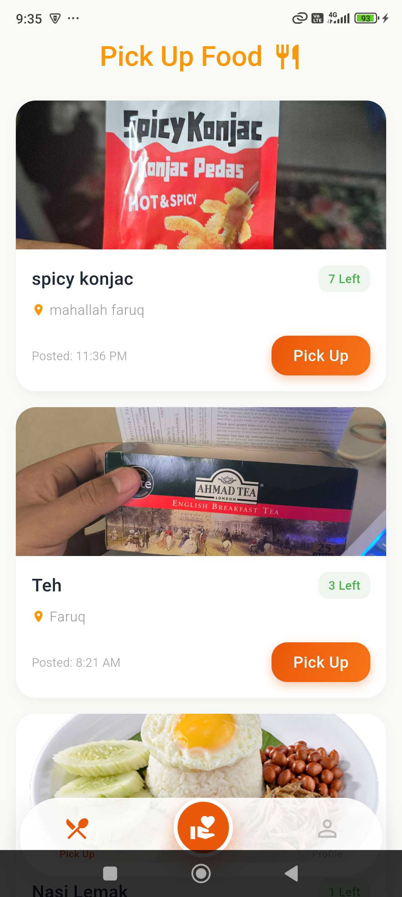
<figcaption><strong>Figure 10:</strong> Receiver Donate Food Page (Restricted)</figcaption>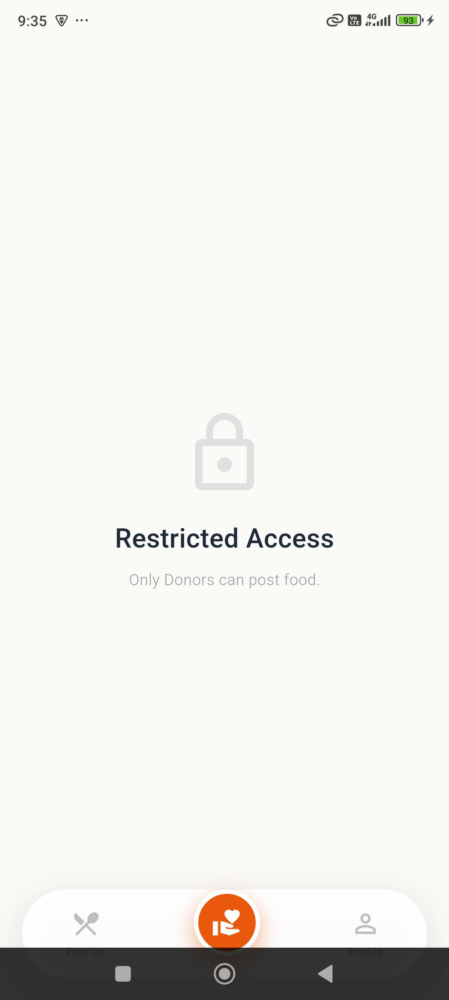

### C. Donor (Cafe Owner) Ecosystem
<figcaption><strong>Figure 11:</strong> Donor Account Page</figcaption>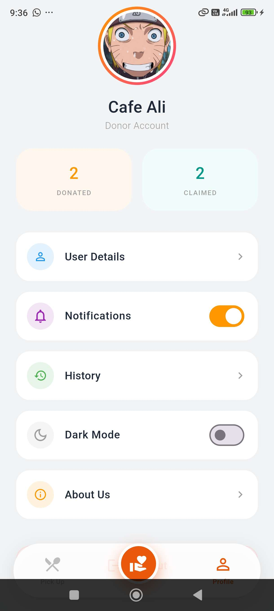
<figcaption><strong>Figure 12:</strong> Donor Donate Food Page</figcaption>
<figcaption><strong>Figure 13:</strong> Donor Add Food Page</figcaption>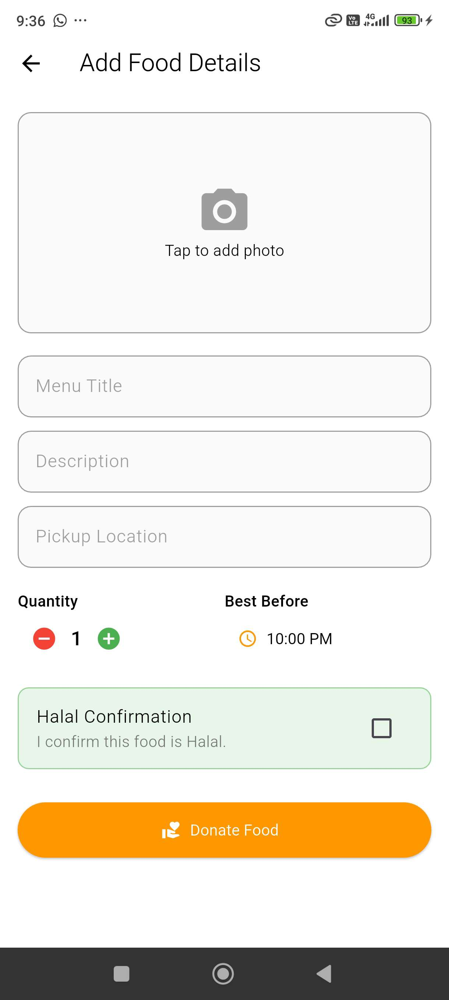

### D. Admin (Moderation) Ecosystem
<figcaption><strong>Figure 14:</strong> Admin Account Page</figcaption>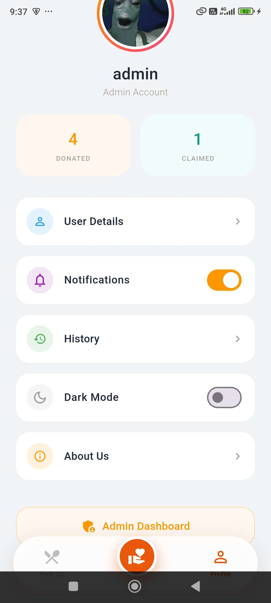
<figcaption><strong>Figure 15:</strong> Admin Dashboard (Manage Users)</figcaption>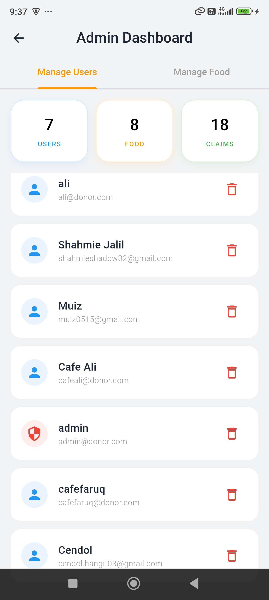
<figcaption><strong>Figure 16:</strong> Admin Dashboard (Manage Food)</figcaption>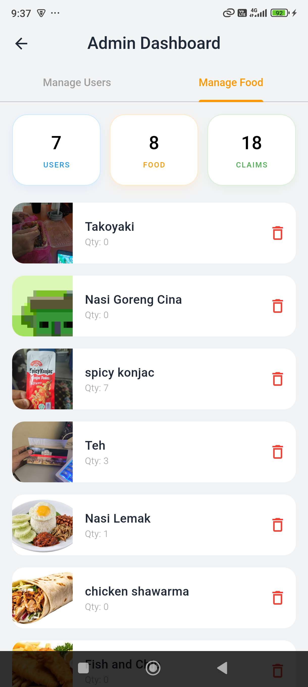

---

## 2. Summary of Achieved Features
We successfully implemented 100% of our core proposal modules, plus an additional Admin panel.

* **Role-Based Authentication:** Users are strictly separated into Student, Donor, and Admin roles upon registration. The app prevents "Students" from accessing "Donor" features (as seen in Figure 5).
* **Real-Time Food Feed:** The Student Home Screen streams data directly from Firestore. When a Donor posts an item, it appears instantly on student devices without refreshing.
* **Inventory Management:** Donors can track how many items are left. If a student claims an item, the "Quantity" counter decrements automatically.
* **Shariah Compliance Tools:**
    * **Halal Check:** Donors *must* tick the "Halal Confirmation" box before posting.
    * **Admin Moderation:** Admins can view all users and food items, with the power to delete inappropriate content or ban suspicious users immediately.
* **Profile Statistics:** Each user has a personalized dashboard showing their total "Donated" or "Claimed" counts.

## 3. Technical Explanation
The application was built using **Flutter** following the **MVVM (Model-View-ViewModel)** architecture to ensure code maintainability and testing.

### Architecture Breakdown
* **Model:** We defined strict data models (`FoodItem`, `UserModel`) that map directly to our Firebase Cloud Firestore collections.
* **View (UI):** All screens (Login, Feed, Profile) are built as stateless/stateful widgets that only handle UI rendering. They do not contain business logic.
* **ViewModel (Provider):** We used the `Provider` package for state management. The ViewModels handle:
    * Fetching data from Firebase.
    * Managing loading states (spinners).
    * Handling user sessions (Auth).
    * Calculating "Remaining Quantity" logic.

### Firebase Integration
* **Authentication:** Handles email/password and Google Sign-In.
* **Firestore:** Used as the NoSQL database. We utilized `.snapshots()` streams for the Food Feed to ensure real-time updates.
* **Storage:** Used to store and retrieve images of the food items uploaded by donors.

## 4. Limitations and Future Enhancements
While the core application is fully functional, we have identified areas for future growth:

### Limitations
1.  **Manual Location Entry:** Currently, donors manually type their location (e.g., "Mahallah Faruq"). There is no GPS map integration to show the exact stall location.
2.  **No In-App Chat:** Coordination relies on the pickup details provided in the description. Students cannot chat with Donors to ask specific questions.
3.  **Basic Search:** The search function currently filters only by food name, not by "nearest location" or "category."

### Future Enhancements
1.  **Map Integration:** Implement Google Maps API to show a "Food Near Me" view, allowing students to visually see available food on the campus map.
2.  **Smart Notifications:** Use Firebase Cloud Messaging (FCM) to alert students when their favorite food type (e.g., "Nasi Lemak") is posted.
3.  **AI Food Recognition:** Implement an AI image classifier (TensorFlow Lite) to auto-detect the food type from the photo, saving time for Donors.
